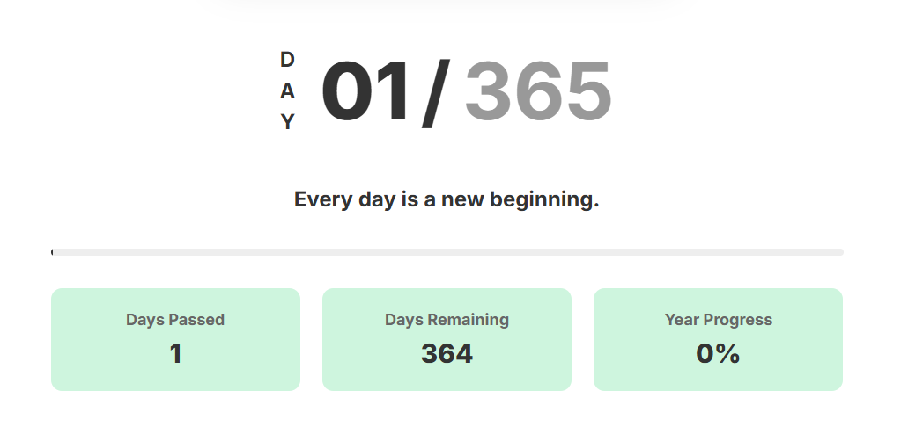

# YearFlow

YearFlow is an elegant web application that visualizes the progression of the year through an interactive interface. It combines a digital clock, day counter, and motivational quotes to help you stay aware of time and maintain productivity.

## ✨ Features

- **Digital Clock**: Real-time display with hours, minutes, and seconds
- **Day Counter**: Shows current day number out of 365/366 days
- **Year Progress**: Visual progress bar showing year completion
- **Daily Statistics**:
  - Days passed in the year
  - Days remaining
  - Year progress percentage
- **Daily Motivational Quotes**: New inspiring quote each day
- **Responsive Design**: Works seamlessly on all devices

## 🚀 Live Demo

Visit [YearFlow](https://fzihak.github.io/YearFlow) to see the application in action.

## Screenshots

### Digital Clock


### Year Progress Tracker and Statistics Display


## 🛠️ Tech Stack

- HTML5
- CSS3
- Vanilla JavaScript
- Google Fonts (Inter)

## 💻 Local Development

1. Clone the repository:
```bash
git clone https://github.com/fzihak/YearFlow.git
```

2. Open `index.html` in your browser

## 🎨 Features Explained

### Digital Clock
- Real-time updating digital display
- 12-hour format with AM/PM indicator
- Smooth animations on number changes

### Year Progress Tracking
- Current day number out of 365/366 (automatically handles leap years)
- Visual progress bar
- Detailed statistics including days passed and remaining

### Daily Quotes
- Curated collection of motivational quotes
- Changes daily
- Stored locally to maintain consistency throughout the day

## 🤝 Contributing

Contributions are welcome! Feel free to:

1. Fork the repository
2. Create your feature branch (`git checkout -b feature/AmazingFeature`)
3. Commit your changes (`git commit -m 'Add some AmazingFeature'`)
4. Push to the branch (`git push origin feature/AmazingFeature`)
5. Open a Pull Request

## 📝 License

This project is open source and available under the [MIT License](LICENSE).

## 👨‍💻 Developer

Developed with ❤️ by [Foysal Zihak](https://github.com/fzihak)

## 🌟 Show Your Support

Give a ⭐️ if you like this project!
